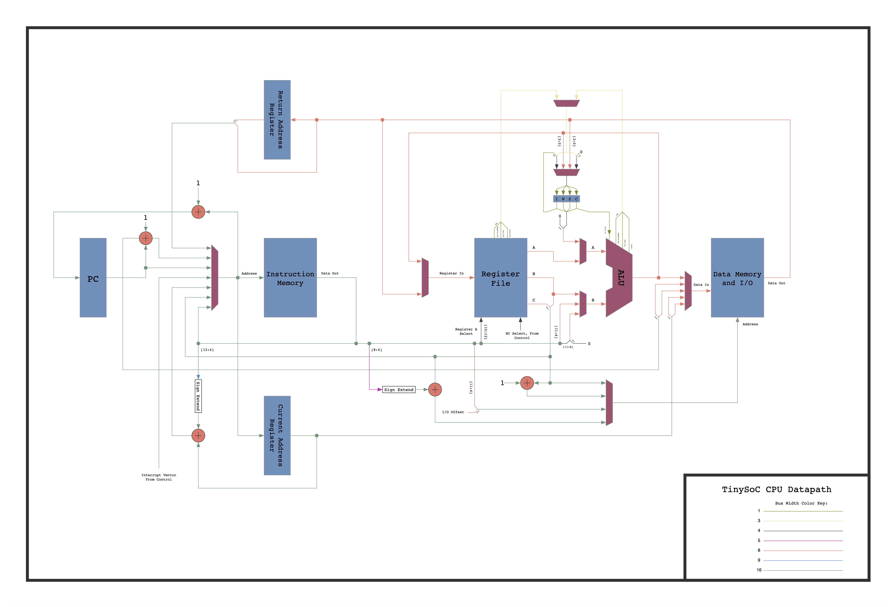
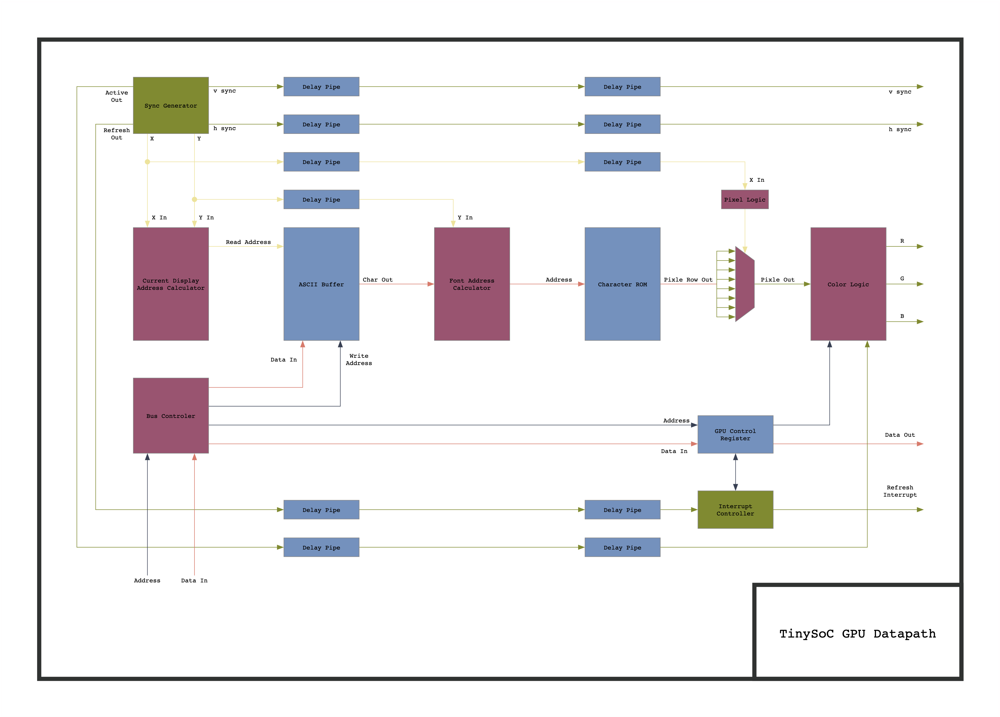

# tinySoC
tinySoC is a small system on a chip consisting of an 8-bit CPU, an 80 column VGA graphics card, GPIO and counter/timer peripherals, all implemented on an ice40 FPGA.

## The CPU

The CPU is an 8-bit RISC core, with a Harvard architecture. It has a 16-bit wide instruction memory, an 8-bit wide data memory, and both have a 16-bit address. The CPU has 16 general purpose 8-bit registers along with a 4-bit status register. The processor is not fully pipelined, but does fetch the next instruction while executing the current one. Most instructions execute in a single clock cycle, but a few take two or three.

## The GPU

The GPU operates in a monochrome 80 column text mode, and outputs a VGA signal at a resolution of 640 by 480 at 60 frames per second. The GPU contains an ASCII buffer which the user can write to in order to display messages on the screen. A control register allows the user to set the text to one of 7 colours, and to enable an interrupt to the CPU which fires every time a frame finishes and enters the blanking period.